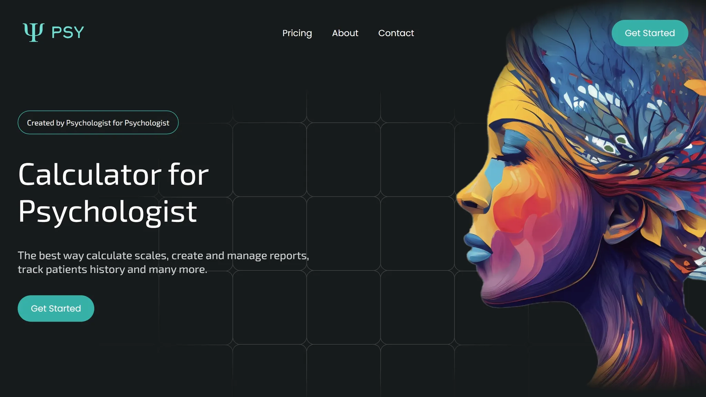

  

# UnPsy

> A psychoanalytical web tool for diverse assessments and automatic analysis with a built-in scanner

  

# Scales

| Scale   | Created | Tested | Published |
| ------- | ------- | ------ | --------- |
| EPQ     | ✓       | ✓      | ✓         |
| EPQ-R   | ✓       | ✓      | ✓         |
| JTCI    | ✓       | ✓      | ✓         |
| MACI    | ✓       | ✓      | ✓         |
| MCMI    | ✓       | ✓      | ✓         |
| MMPI-RF | ✓       | ✓      | ✓         |
| MPQ     | ✓       | ✓      | ✓         |
| TCI     | ✓       | ✓      | ✓         |
| SCL-90R | ✓       | ✓      | ✓         |
| DSMD-A  | ✓       | ✓      | ✓         |
| DSMD-C  | ✓       | ✓      | ✓         |
| JEPQ    | -       | -      | -         |
| LEYTON  | -       | -      | -         |
| BAI     | -       | -      | -         |
